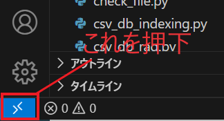
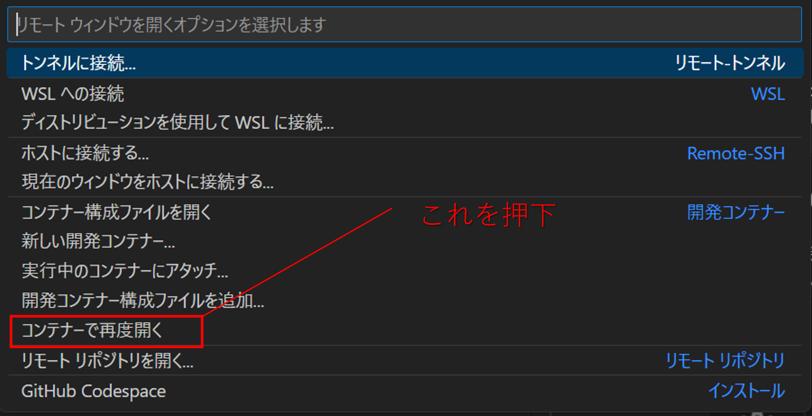

# 社長ボット

## ■ はじめに
こちらの[リポジトリ](https://github.com/SakutoHata/president-bot_RAG)をPython3.11にて運用可能にしたものです。<br>
Docker＋Ubuntu環境で運用することを想定しています。

## ■ セットアップ
「*初回のみ*」と付くものは、初回で必須の対応となります。<br>
初回以降は、必要に応じて「[7.アプリの起動](#7アプリの起動毎回行うこと)」のみ実行して下さい。

### 1. Docker Desktopの導入（初回のみ）
こちらの方の[記事](https://zenn.dev/seiya0/articles/tech-docker-desktop-for-win-install)などを参考に導入して下さい。

### 2. VSCode環境構築（初回のみ）
1. Remote-SSHの導入
- こちらの[拡張機能](https://marketplace.visualstudio.com/items?itemName=ms-vscode-remote.vscode-remote-extensionpack)をインストールして下さい。

### 3. 環境変数（初回のみ）
本アプリケーションを使うにあたり、"*presidentblog-bot_RAG_py3.11/.env*" にて、各keyを認識させておいて下さい。
```
AZURE_OPENAI_API_KEY="..."      # AzureOpenAI のkey
AZURE_OPENAI_ENDPOINT="..."     # AzureOpenAI の エンドポイント
LLM_MODELS="..."                # 対話用 model のkey
LLM_MODELS_TURBO="..."          # embedding model のkey
EM_MODELS="..."                 # embedding model のkey
FILE_PATH="./src"
MODE="csv_index"
```

### 4. Indexに追加するドキュメントの配置
1. ナレッジ元となるCSVファイルの用意<br>
    CSVファイルを以下に配置：*src/db/csv_index/add_data/＊＊＊.csv*

### 5. 画像準備（初回のみ）
bot側UIのアイコン画像、3Dモデル背景画像の設定を行います。

- bot側UIのアイコン画像
    - botの画像アイコンを以下に配置：*src/static/images/bot-icon.png*
    - userの画像アイコンを以下に配置：*src/static/images/user-icon.png*
- 3Dモデル背景画像
    - 背景画像を以下に配置：*src/static/images/background.jpg*

### 6. モデル/アニメーション準備（初回のみ）
3Dモデル（VRMファイル）、アニメーション（VRMAファイル）の設定を行います。

- 3Dモデルを以下に配置：*src/static/models/vrm/vrm_model.vrm*
- アニメーションを以下に配置（計4つ）：*src/static/motions/vrma/SampleN.vrma*
- "/templates/index.html"の193行～197行の内容を配置したアニメーションファイルに更新して下さい。<br>

    例）Sample1,2,3,4を配置した場合
    ```
    // アニメーション設定
    const Starting_vrma = '/static/motions/vrma/Sample1.vrma'   //起動時に再生するアニメーション
    const StanBy_vrma = '/static/motions/vrma/Sample2.vrma'     //一定時間経過後、操作がない場合に再生するアニメーション
    const Thinking_vrma = '/static/motions/vrma/Sample3.vrma'   //回答準備中に再生するアニメーション
    const Answering_vrma = '/static/motions/vrma/Sample4.vrma'  //回答生成完了時に再生するアニメーション
    ```

### 7.アプリの起動（毎回行うこと）
1. コンテナへの接続<br>
1-1.  VSCode内の右下にあるボタンを押下<br>
<br>

    1-2.  ポップアップした画面の「コンテナで再度開く」を押下<br>
    <br>

    初回の立ち上げは暫く時間がかかります。終了次第、次のステップに移行して下さい。

2. コマンドラインで以下を実行<br>
    ```
    python "./src/main.py"
    ```
